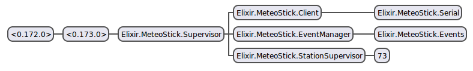

# MeteoStick

**A Client for the [MeteoStick USB Stick](http://www.smartbedded.com/wiki/index.php/Meteostick)**

This library works specifically with the [Fine Offset HP-100x](http://www.foshk.com/weather_professional/) available in the U.S at [Ambient Weather](http://www.ambientweather.com/amws1000array.html)

## Use

    1. git clone https://github.com/NationalAssociationOfRealtors/raven.git
    2. mix do deps.get, deps.compile
    3. iex -S mix

## Explanation

As a new sensor array starts broadcasting, a process is started to parse and store the state of the sensor array. Each update triggers an event notification over `Meteostick.Events` event bus. You can add a handler to the event bus by calling `MeteoStick.EventManager.add_handler`. To see an example implementation of a handler look at `MeteoStick.Handler` and also be sure to look at the tests.

An event is the state of a sensor array which looks like this.

    %MeteoStick.WeatherStation.State{
        humidity: {55.0, ""},
        id: "73",
        indoor_temperature: 0,
        outdoor_temperature: {24.1, ""},
        pressure: 0,
        rain: {11.0, ""}, #measured in ticks...
        solar: %{
            intensity: {77.5, ""},
            radiation: {0.6, ""}
        },
        uv: {0.0, ""},
        wind: %{
            direction: {180.0, ""},
            gust: {0.0, ""},
            speed: {0.0, ""}
        }
    }

## Architecture

`MeteoStick.Client` is a small Serial client. It is the main interface for sending and receiving messages. As a new weather station is discovered a process is spawned through `MeteoStick.StationSupervisor` and the station processes state represents the station's attributes.

Every 16 seconds the station sends updated attribute information, the station process (`MeteoStick.WeatherStation`) parses the data and updates it's state, the state is then broadcast (using notify) over `MeteoStick.Events` event bus. Anyone can add a handler to the event bus to handle updated station state by calling `MeteoStick.EventManager.add_handler`. See `MeteoStick.Handler` for an example implementation of an event handler.
